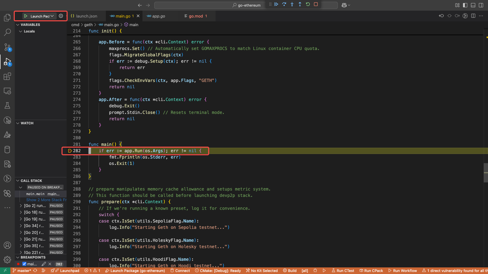

1. Install `golang` and `delve` in macbook.
```bash
### If there is go installed, remove it first
❯ sudo rm -rf /usr/local/go
### Install go by downloding the latest version (1.24.2) from https://go.dev/ for macOS Arm64.
❯ go version
go version go1.24.2 darwin/arm64
❯ go mod tidy
xxxxxxxxxxxxxxxxxxxxxx
### Install Delve.
❯ go install github.com/go-delve/delve/cmd/dlv@latest
❯ dlv version
2025-04-20T11:06:43+08:00 warn layer=dlv CGO_CFLAGS already set, Cgo code could be optimized.
Delve Debugger
Version: 1.24.2
Build: $Id: xxxxxxxxxxxxxxxxxxxxxx $
```
2. Configure Golang-related tools in vscode.
```bash
gopls is the language server of Go, responsible for functions such as code navigation and auto-completion. 

If it is not installed or the version is too old, it may cause the jump function to fail. 
 
Check and install gopls: 
1. Open the command panel of VS Code (Shortcut key: Cmd+Shift+P). 
2. Enter and select "Go: Install/Update Tools". 
3. In the pop-up list of tools, make sure to check gopls and then click "OK". 
4. Wait for the installation to be completed.
```


3. Create the `.vscode /launch.json` file.
```json
{
    "version": "0.2.0",
    "configurations": [
        {
            "name": "Launch Package",
            "type": "go",
            "request": "launch",
            "mode": "auto",
            "program": "${workspaceFolder}/cmd/geth"
        }
    ]
}
```
4. Set breakpoints in the code from `cmd/geth/main.go:282`.

5. Run the debugger.
