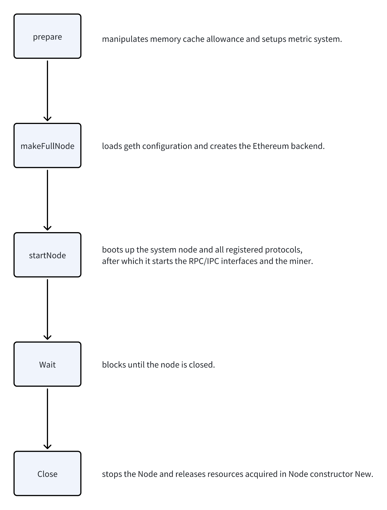
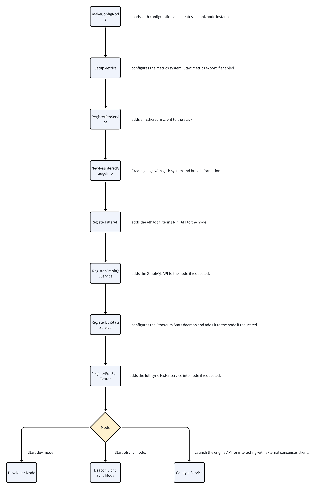
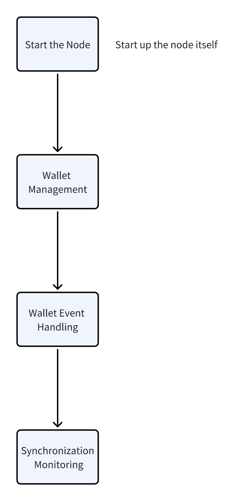

# The entire process of starting an Ethereum node
## Preview 
1. The basic concept, key features, working principles, and use cases of Go-Ethereum (Geth).
2. The code structure of Geth, including the purpose of each directory and subdirectory.
3. The entire process of starting an ethereum node.
## What is Go-Ethereum (Geth)?
Go-Ethereum, commonly referred to as Geth, is one of the most widely used Ethereum clients. It is an open-source implementation of the Ethereum protocol written in the Go programming language. Geth allows users to interact with the Ethereum blockchain, whether as a full node, light client, or miner.

### Key Features of Go-Ethereum:
1. Ethereum Node:<br>
Geth can operate as a full node, downloading and validating the entire Ethereum blockchain.
It can also run as a light client, downloading only essential data and relying on full nodes for additional information.
2. Mining:<br>
Geth supports mining on Ethereum, allowing users to participate in the network's consensus mechanism by validating transactions and creating new blocks.
3. Smart Contract Interaction:<br>
Geth provides tools to deploy, interact with, and debug smart contracts on the Ethereum blockchain.
4. JSON-RPC and WebSocket APIs:<br>
Geth exposes APIs for developers to interact with the Ethereum network programmatically. These APIs support operations like querying blockchain data, sending transactions, and managing accounts.
5. GraphQL Support:<br>
Geth includes support for GraphQL, enabling efficient and flexible queries for blockchain data.
6. Customizable Configuration:<br>
Geth offers a wide range of configuration options, including flags for networking, storage, consensus, and debugging.
7. Cross-Platform:<br>
Geth is available on multiple platforms, including Linux, macOS, and Windows.

### How Geth Works:
1. Blockchain Synchronization:<br>
a. Geth synchronizes with the Ethereum network by downloading blocks and validating transactions.<br>
b. It supports multiple synchronization modes:<br>
<div style="margin-left: 60px;"> Full Sync: Downloads and processes the entire blockchain. </div>
<div style="margin-left: 60px;"> Fast Sync: Downloads block headers and the current state without processing historical transactions. </div>
<div style="margin-left: 60px;"> Light Sync: Downloads only block headers and relies on full nodes for additional data. </div>

2. Peer-to-Peer Networking:<br>
Geth uses Ethereum's devp2p protocol to connect with other nodes in the network, enabling decentralized communication and data sharing.
3. Account Management:<br>
Geth allows users to create and manage Ethereum accounts, including generating private/public key pairs and signing transactions.
4. Consensus:<br>
Geth supports Ethereum's consensus mechanisms, including Proof of Stake (PoS) for Ethereum 2.0 and legacy Proof of Work (PoW).

### Use Cases of Geth:
1. Running an Ethereum Node:<br>
Users can run a full node to validate transactions, participate in consensus, and contribute to the decentralization of the Ethereum network.
2. DApp Development:<br>
Developers use Geth to interact with the Ethereum blockchain, deploy smart contracts, and test decentralized applications (DApps).
3. Mining:<br>
Geth can be used for mining Ether (ETH) by validating transactions and creating new blocks.
4. Blockchain Exploration:<br>
Geth provides tools to query blockchain data, such as blocks, transactions, and account balances.
5. Testing and Development:<br>
Geth's developer mode (--dev) allows for fast, iterative testing in an isolated environment.

### Code structure
This directory structure reflects the modular design of the Ethereum Go client, with each directory focusing on a specific aspect of the Ethereum protocol or client functionality.

| Directory | Purpose | Details | Subdirectory |
| --------- | ------- | ------- | ------------ |
| `accounts` | Manages Ethereum accounts and wallets. | a. Handles key storage, account creation, and signing transactions.<br> b. Includes support for hardware wallets (e.g., Ledger, Trezor) and external signers.<br> | `keystore`:<br> Manages encrypted private keys stored on disk.<br> `usbwallet`:<br> Provides support for USB-based hardware wallets.<br> `external`:<br> Interfaces with external account signers.<br> |
| `beacon` | Implements Ethereum's Beacon Chain functionality for Proof-of-Stake (PoS). | a. Contains modules for syncing, light clients, and Merkle tree operations.<br> b. Supports the Beacon Chain's consensus and data structures.<br> | |
| `build` | Contains build scripts, CI/CD configurations, and packaging tools. | a. Includes scripts for building and packaging binaries (e.g., .deb, .exe).<br> b. Contains CI-related files for Travis, AppVeyor, and GitHub Actions.<br> | | 
| `cmd` | Contains the main entry points for various Ethereum tools and binaries. | | `geth`:<br> The main Ethereum client.<br> `abigen`:<br> Generates Go bindings for Ethereum smart contracts.<br> `clef`:<br> A lightweight account signer.<br> `evm`:<br> A standalone Ethereum Virtual Machine (EVM) for testing and debugging.<br> `devp2p`:<br> Tools for Ethereum's P2P networking.<br> |
| `common` | Provides shared utilities and helper functions used across the codebase. | a. Includes utilities for working with big integers, byte arrays, and cryptographic hashes.<br> b. Contains common data structures like LRU caches and priority queues.<br> | |
| `consensus` | Implements Ethereum's consensus algorithms. | | `ethash`:<br> Implements Proof-of-Work (PoW) consensus.<br> `clique`:<br> Implements Clique, Ethereum's Proof-of-Authority (PoA) consensus.<br> `beacon`:<br> Supports the Beacon Chain for Proof-of-Stake (PoS).<br> |
| `console` | Implements the interactive JavaScript console for interacting with the Ethereum client. | a. Allows users to execute commands and interact with the Ethereum node via JavaScript.<br> b. Includes support for custom scripts and debugging tools.<br> | |
| `core` | Implements Ethereum's core blockchain functionality. | Handles block validation, transaction processing, and state management. | `rawdb`:<br> Provides low-level database access.<br> `state`:<br> Manages the Ethereum state trie.<br> `txpool`:<br> Manages the transaction pool.<br> `types`:<br> Defines core Ethereum data structures like blocks and transactions.<br> |
| `crypto` | Provides cryptographic utilities and algorithms. | a. Includes implementations of elliptic curve cryptography (secp256k1), hashing algorithms (e.g., Keccak256), and signature schemes.<br> b. Supports cryptographic primitives used in Ethereum.<br> | | 
| `eth` | Implements the Ethereum protocol and node functionality. | a. Handles syncing, peer-to-peer networking, and transaction propagation. | `downloader`:<br> Manages blockchain synchronization.<br> `gasprice`:<br> Implements gas price estimation algorithms.<br> `filters`:<br> Handles event filters for logs and transactions.<br> |
| `ethclient` | Provides a Go client for interacting with Ethereum nodes. | a. Allows developers to interact with Ethereum nodes via JSON-RPC.<br> b. Includes support for contract calls, transactions, and querying blockchain data.<br> | |
| `ethdb` | Provides database backends for Ethereum. | a. Includes support for LevelDB, memory databases, and remote databases.<br> b. Manages storage for blockchain data, state, and transactions.<br> | |
| `ethstats` | Implements the Ethereum network statistics reporting tool. | Allows nodes to report their status (e.g., block height, peers) to monitoring services. | | 
| `event` | Implements an event subscription system. | Provides a publish-subscribe mechanism for internal events (e.g., new blocks, transactions). | | 
| `graphql` | Implements a GraphQL API for Ethereum. | a. Allows querying Ethereum data using GraphQL.<br> b. Includes schema definitions and query handlers.<br> | |
| `internal` | Contains internal packages not exposed to external users. | Includes utilities for testing, debugging, and command-line tools. | |
| `log` | Implements logging functionality for the Ethereum client. | Provides structured logging with support for different log levels and backends. | | 
| `metrics` | Implements performance monitoring and metrics collection. | a. Supports exporting metrics to Prometheus, InfluxDB, and other backends.<br> b. Includes utilities for tracking CPU, memory, and disk usage.<br> | | 
| `miner` | Implements Ethereum's mining functionality. | Handles block creation, transaction selection, and Proof-of-Work (PoW) mining. | |
| `node` | Implements the core Ethereum node functionality. | a. Manages the lifecycle of the node, including starting/stopping services and RPC endpoints.<br> b. Handles configuration, account management, and database access.<br> | |
| `p2p` | Implements Ethereum's peer-to-peer networking layer. | Handles peer discovery, connection management, and message propagation. | `enode`:<br> Manages Ethereum node identities.<br> `dnsdisc`:<br> Implements DNS-based peer discovery.<br> |
| `params` | Defines Ethereum network parameters and configurations. | Includes chain configurations, fork rules, and protocol parameters. | |
| `rlp` | Implements Recursive Length Prefix (RLP) encoding/decoding. | RLP is used to serialize Ethereum data structures like blocks and transactions. | |
| `rpc` |  Implements the JSON-RPC server and client for Ethereum. | a. Handles RPC requests for interacting with the Ethereum node.<br> b. Supports HTTP, WebSocket, and IPC transports.<br> | |
| `singer` | Implements tools for signing transactions and managing rules. | Includes support for signing policies and storage for private keys. | |
| `tests` | Contains test cases and utilities for Ethereum. | Includes state tests, transaction tests, and fuzzing tools. | |
| `trie` | Implements Ethereum's Merkle Patricia Trie. | a. The trie is used to store Ethereum's state and account data.<br> b. Includes utilities for trie iteration, hashing, and proof generation.<br> | | 
| `version` | Contains versioning information for the Ethereum client. | Defines the client version and release metadata. | | 

## Entry function
The entry function of launching one go-ethereum node is main() in `cmd/geth/main.go`.<br>
In `cmd/geth/main.go`, there are three important parts: `Flags`, `Functions about initialization` and `main function`.<br>
### execution sequence
For golang, the execution sequence of the program is as follows:<br>
1. import statements (and their init() functions, if any).<br>
2. const declarations (compile-time initialization).<br>
3. Global variable initialization.<br>
4. init() function (current package).<br>
5. main() function (program entry point).<br>
### import
(TODO)
### Global variable initialization
The provided flags are configurations used to customize the behavior of the Ethereum client (geth). These flags are grouped into three main categories: nodeFlags, rpcFlags, and metricsFlags. Each category serves a specific purpose:<br>
| Category | Flag Group | Purpose |
| ---- | ---- | ----------- |
| Node Configuration | nodeFlags | Configure the Ethereum node's behavior, including networking, storage, and consensus. |
| RPC Interfaces | rpcFlags | Configure HTTP, WebSocket, and IPC interfaces for external communication. |
| Metrics and Monitoring | metricsFlags | Configure metrics and monitoring settings for the node (e.g., InfluxDB). |

Read following flags' details in `cmd/utils/flags.go`.<br>

#### 1. nodeFlags
These flags control the core behavior of the Ethereum node, including networking, storage, and consensus-related configurations.
* Identity and Accounts: <br>

| flag | description |
| ---- | ----------- |
| utils.IdentityFlag | Sets the node's identity. |
| utils.UnlockedAccountFlag | Unlocks specific accounts for use. |
| utils.PasswordFileFlag | Specifies a file containing account passwords. |

* Networking:

| flag | description |
| ---- | ----------- |
| utils.BootnodesFlag | Specifies bootnodes for peer discovery. |
| utils.ListenPortFlag | Sets the port for incoming connections. |
| utils.DiscoveryPortFlag | Sets the port for discovery protocol. |
| utils.NoDiscoverFlag | Disables peer discovery. |
| utils.DiscoveryV4Flag, utils.DiscoveryV5Flag | Enable/disable specific discovery protocols. |
| utils.NetrestrictFlag | Restricts connections to specific subnets. |

* Storage and Database:

| flag | description |
| ---- | ----------- |
| utils.KeyStoreDirFlag | Specifies the keystore directory. |
| utils.CacheFlag | Sets the cache size for the database. |
| utils.CacheDatabaseFlag, utils.CacheTrieFlag | Fine-tune database caching. |
| utils.LightServeFlag, utils.LightIngressFlag | Flags for light client mode (deprecated). |

* Consensus and Mining:

| flag | description |
| ---- | ----------- |
| utils.SyncModeFlag | Sets the synchronization mode (e.g., full, fast, light). |
| utils.MinerGasLimitFlag, utils.MinerGasPriceFlag | Configure mining-related parameters. |
| utils.MinerExtraDataFlag | Sets extra data for mined blocks. |


| Sync Mode | Description | How it works | Use case |
| ---- | ----------- | -------- | ----------- |
| Full | The node downloads the entire blockchain, including all blocks and their associated data (e.g., transactions, receipts, and state). | a. The node starts from the genesis block and processes every block sequentially.<br> b. It executes all transactions to reconstruct the current state of the blockchain. | Ideal for archival purposes or when a complete history of the blockchain is required. | 
| Fast | The node downloads the blockchain data quickly by skipping the execution of historical transactions. | a. The node downloads block headers and bodies up to the latest state.<br> b. It fetches the current state (e.g., account balances, contract storage) from peers and verifies it.<br> c. Historical transactions are not executed, but the node can still serve them if needed. | Commonly used by most nodes to quickly join the network without requiring full historical data. |
| Light | The node operates as a "light client," downloading only block headers and relying on full nodes for additional data. | a. The node does not store the full blockchain or state.<br> b. It queries full nodes for specific data (e.g., transaction details, account balances) when needed. | Suitable for resource-constrained devices (e.g., mobile or embedded systems) or when minimal storage and bandwidth usage are required. |
 | |

* Debugging and Logging:

| flag | description |
| ---- | ----------- |
| utils.LogDebugFlag | Enables debug logging. |
| utils.LogBacktraceAtFlag | Enables backtraces for debugging. |
| utils.VMEnableDebugFlag | Enables debugging for the Ethereum Virtual Machine (EVM). |


* Miscellaneous:

| flag | description |
| ---- | ----------- |
| utils.DeveloperFlag | Enables developer mode for testing. |
| utils.NetworkIdFlag | Sets the network ID for the node. |
| utils.EthStatsURLFlag | Configures the URL for reporting node stats. |


#### 2. rpcFlags
These flags configure the RPC interfaces, which allow external applications to interact with the Ethereum node.

* HTTP RPC:

| flag | description |
| ---- | ----------- |
| utils.HTTPEnabledFlag | Enables the HTTP RPC server. |
| utils.HTTPListenAddrFlag | Sets the HTTP server's listening address. |
| utils.HTTPPortFlag | Sets the HTTP server's port. |
| utils.HTTPCORSDomainFlag | Configures CORS domains for HTTP requests. |
| utils.HTTPApiFlag | Specifies the APIs exposed over HTTP. |


```bash
CORS (Cross-Origin Resource Sharing) is a browser security mechanism that allows or restricts web applications running at one origin (domain) to make requests to resources on a different origin. It is designed to address the limitations imposed by the Same-Origin Policy, which blocks such cross-origin requests by default for security reasons.

How CORS Works ?

When a web application makes a cross-origin request (e.g., using fetch or XMLHttpRequest), the browser sends a preflight request (an HTTP OPTIONS request) to the server to check if the actual request is allowed. The server responds with specific HTTP headers that indicate whether the request is permitted.

CORS in Ethereum

In Ethereum, CORS is often configured for HTTP RPC or WebSocket RPC interfaces to control which front-end applications can interact with the Ethereum node.
```

* WebSocket RPC:

| flag | description |
| ---- | ----------- |
| utils.WSEnabledFlag | Enables the WebSocket RPC server. |
| utils.WSListenAddrFlag | Sets the WebSocket server's listening address. |
| utils.WSPortFlag | Sets the WebSocket server's port. |
| utils.WSApiFlag | Specifies the APIs exposed over WebSocket. |
| utils.WSAllowedOriginsFlag | Configures allowed origins for WebSocket connections. |


* IPC (Inter-Process Communication):

| flag | description |
| ---- | ----------- |
| utils.IPCDisabledFlag | Disables the IPC server. |
| utils.IPCPathFlag | Sets the IPC file path. |


* Security:

| flag | description |
| ---- | ----------- |
| utils.JWTSecretFlag | Configures the JWT secret for authentication. |
| utils.InsecureUnlockAllowedFlag | Allows insecure account unlocking. |


* Performance:

| flag | description |
| ---- | ----------- |
| utils.BatchRequestLimit | Sets the maximum number of batch requests. |
| utils.BatchResponseMaxSize | Sets the maximum size of batch responses. |


#### 3. metricsFlags
These flags configure metrics and monitoring for the Ethereum node.

* Metrics Server:

| flag | description |
| ---- | ----------- |
| utils.MetricsEnabledFlag | Enables metrics collection. |
| utils.MetricsHTTPFlag | Enables the HTTP metrics server. |
| utils.MetricsPortFlag | Sets the port for the metrics server. |


* InfluxDB Integration:

| flag | description |
| ---- | ----------- |
| utils.MetricsEnableInfluxDBFlag | Enables InfluxDB integration. |
| utils.MetricsInfluxDBEndpointFlag | Sets the InfluxDB endpoint. |
| utils.MetricsInfluxDBDatabaseFlag | Specifies the InfluxDB database. |
| utils.MetricsInfluxDBUsernameFlag | Sets the InfluxDB username. |
| utils.MetricsInfluxDBPasswordFlag | Configure InfluxDB authentication. |
| utils.MetricsInfluxDBTagsFlag | Sets custom tags for InfluxDB metrics. |


* InfluxDB v2:

| flag | description |
| ---- | ----------- |
| utils.MetricsEnableInfluxDBV2Flag | Enables InfluxDB v2 integration. |
| utils.MetricsInfluxDBTokenFlag | Sets the InfluxDB v2 token. |
| utils.MetricsInfluxDBBucketFlag | Specifies the InfluxDB v2 bucket. |
| utils.MetricsInfluxDBOrganizationFlag | Sets the InfluxDB v2 organization. |


#### 4. cli.App
```go
// NewApp creates an app with sane defaults.
func NewApp(usage string) *cli.App {
	git, _ := version.VCS()
	app := cli.NewApp()
	app.EnableBashCompletion = true
	app.Version = version.WithCommit(git.Commit, git.Date)
	app.Usage = usage
	app.Copyright = "Copyright 2013-2025 The go-ethereum Authors"
	app.Before = func(ctx *cli.Context) error {
		// MigrateGlobalFlags makes all global flag values available in the
		// context. This should be called as early as possible in app.Before.
		MigrateGlobalFlags(ctx)
		return nil
	}
	return app
}

var app = flags.NewApp("the go-ethereum command line interface")
```
The urfave/cli/v2 library is a popular Go package for building command-line applications. It provides a simple and structured way to define commands, flags, and application behavior, making it easier to create robust CLI tools.<br>

* Key Features of urfave/cli/v2

| Feature | Description |
| ------- | ----------- |
| Command Management | a. Allows you to define multiple commands, each with its own functionality.<br> b. Commands can have subcommands, enabling hierarchical CLI structures. |
| Flag Support | a. Supports global flags (applicable to all commands) and command-specific flags.<br> b. Flags can be of various types, such as string, int, bool, etc. |
| Lifecycle Hooks | a. Provides Before and After hooks for executing logic before or after a command runs.<br> b. Useful for tasks like setting up configurations or cleaning up resources. |
| Bash Completion | Automatically generates bash completion scripts for commands and flags. | 
| Error Handling | Built-in support for handling errors gracefully and displaying helpful error messages. |
| Extensibility | Easily integrates with other Go libraries and allows custom logic for advanced use cases. |


### init()
The init() function is responsible for configuring the Geth CLI application. It defines the available commands, flags, and lifecycle hooks (Before and After). This setup ensures that the CLI is flexible, extensible, and adheres to best practices for command-line tools.<br>

1. CLI App Initialization
```go
// Initialize the CLI app and start Geth.
// geth is the main entry point into the system if no special subcommand is run. It creates a default node based on the command line arguments and runs it in blocking mode, waiting for it to be shut down.
app.Action = geth
```
* This sets the default action for the CLI app to geth. This means that if no specific command is provided, the geth function will be executed.<br>
2. Defining Commands
```go
app.Commands = []*cli.Command{
	// See chaincmd.go:
	initCommand,
	importCommand,
	exportCommand,
	importHistoryCommand,
	exportHistoryCommand,
	importPreimagesCommand,
	removedbCommand,
	dumpCommand,
	dumpGenesisCommand,
	pruneCommand,
	// See accountcmd.go:
	accountCommand,
	walletCommand,
	// See consolecmd.go:
	consoleCommand,
	attachCommand,
	javascriptCommand,
	// See misccmd.go:
	versionCommand,
	versionCheckCommand,
	licenseCommand,
	// See config.go
	dumpConfigCommand,
	// see dbcmd.go
	dbCommand,
	// See cmd/utils/flags_legacy.go
	utils.ShowDeprecated,
	// See snapshot.go
	snapshotCommand,
	// See verkle.go
	verkleCommand,
	}
```
* This block defines the list of commands available in the CLI. Each command corresponds to a specific functionality, such as initializing the blockchain (initCommand), importing/exporting data, managing accounts, interacting with the console, and more.
* Commands are grouped by their functionality, with comments indicating their source files (e.g., chaincmd.go, accountcmd.go).
3. Sorting Commands
```go
sort.Sort(cli.CommandsByName(app.Commands))
```
* Commands are sorted alphabetically by name to ensure they are displayed in an organized manner when the user lists them.
4. Defining Flags
```go
app.Flags = slices.Concat(
    nodeFlags,
    rpcFlags,
    consoleFlags,
    debug.Flags,
    metricsFlags,
)
```
* Flags are options that can be passed to the CLI to configure its behavior. Here, flags are concatenated from various sources (e.g., nodeFlags, rpcFlags, etc.) to form a comprehensive list.
5. Lifecycle Hooks<br>
* Before Hook: This hook runs before any command is executed. It:<br>
a. Automatically adjusts the GOMAXPROCS value to match the CPU quota in Linux containers.<br>
b. MigrateGlobalFlags makes all global flag values available in the context.<br>
c. Setup initializes profiling and logging based on the CLI flags.<br>
d. Validates environment variables.<br>
```go
app.Before = func(ctx *cli.Context) error {
    maxprocs.Set() // Adjusts GOMAXPROCS based on CPU quota.
    flags.MigrateGlobalFlags(ctx)
    if err := debug.Setup(ctx); err != nil {
        return err
    }
    flags.CheckEnvVars(ctx, app.Flags, "GETH")
    return nil
}
```
* After Hook: This hook runs after a command is executed. It:<br>
a. Cleans up debugging resources.<br>
b. Resets the terminal mode by closing the standard input.<br>
```go
app.After = func(ctx *cli.Context) error {
    debug.Exit()
    prompt.Stdin.Close() // Resets terminal mode.
    return nil
}
```

### geth
`geth` is the main entry point into the system if no special subcommand is run. It creates a default node based on the command line arguments and runs it in blocking mode, waiting for it to be shut down.
```go
func geth(ctx *cli.Context) error {
	// 1. Invalid Command Check: If unexpected arguments are passed, it returns an error.
	if args := ctx.Args().Slice(); len(args) > 0 {
		return fmt.Errorf("invalid command: %q", args[0])
	}
	// 2. Preparation: Calls the prepare function to configure the node.
	prepare(ctx)
	// 3. Node Initialization: Creates a full Ethereum node using makeFullNode(ctx) and ensures it is properly closed when the function exits.
	// makeFullNode loads geth configuration and creates the Ethereum backend.
	stack := makeFullNode(ctx)
	defer stack.Close()
	// 4. Node Startup: Calls startNode(ctx, stack, false) to start the node and its associated protocols. 
	// startNode boots up the system node and all registered protocols, after which it starts the RPC/IPC interfaces and the miner.
	startNode(ctx, stack, false)
	// 5. Waits for the node to shut down using stack.Wait().
	stack.Wait()
	return nil
}
```

`prepare` function is a foundational step in the Geth startup process. It ensures that the node is configured correctly based on the user's input and the network context. By handling testnets, developer mode, and mainnet optimizations, it provides a robust and flexible initialization process for Ethereum nodes.
* prepare manipulates memory cache allowance and setups metric system.
* This function should be called before launching devp2p stack.

| Function | Description | Extra |
| ------- | ----------- | ----- |
| Testnet Selection | 1. Logs the network being used (e.g., Sepolia, Holesky, Hoodi, or mainnet).<br> 2. If the --dev flag is set, it starts the node in developer mode and logs warnings about its ephemeral nature (e.g., in-memory database, temporary accounts, no networking). | You are running Geth in --dev mode. Please note the following:<br> 1. This mode is only intended for fast, iterative development without assumptions on security or persistence.<br> 2. The database is created in memory unless specified otherwise. Therefore, shutting down your computer or losing power will wipe your entire block data and chain state for your dev environment.<br> 3. A random, pre-allocated developer account will be available and unlocked as eth.coinbase, which can be used for testing. The random dev account is temporary, stored on a ramdisk, and will be lost if your machine is restarted.<br> 4. Mining is enabled by default. However, the client will only seal blocks if transactions are pending in the mempool. The miner's minimum accepted gas price is 1.<br> 5. Networking is disabled; there is no listen-address, the maximum number of peers is set to 0, and discovery is disabled. |
| Cache Adjustment | If the node is running on the mainnet and no custom cache size is specified, it increases the default cache size to 4096 MB for better performance. | |
 |

Purpose of Disabling Networking in Testnets
| Reason | Description |
| ------ | ----------- |
| Isolation | a. By disabling networking, the node operates in complete isolation, ensuring that it does not connect to other peers or the broader Ethereum network.<br> b. This is useful for testing scenarios where external factors (e.g., peer behavior, network latency) could interfere with the results. |
| Ephemeral Development | In developer mode (--dev), the focus is on fast, iterative development. Networking is unnecessary in this context because the node is not meant to interact with other nodes or participate in consensus. | 
| Resource Optimization | Disabling networking reduces resource usage (e.g., CPU, memory, and bandwidth) since the node does not need to manage peer connections, discovery protocols, or network traffic. |
| Security | Preventing external connections ensures that the test environment is secure and isolated from potential attacks or unintended interactions with other nodes. |
| Simplified Testing | Developers can focus on testing specific features (e.g., smart contracts, transactions, or mining) without worrying about network-related complexities. |
 

Key Characteristics in Dev Mode

| Characteristic | Description |
| ------------- | ----------- |
| No Listen Address | The node does not bind to any network interface, making it inaccessible to other nodes. | 
| Maximum Peers Set to 0 | The node does not attempt to connect to or accept connections from any peers. | 
| Discovery Disabled | The node does not participate in the peer discovery protocol, ensuring it remains isolated. |


`makeFullNode` function is responsible for creating and configuring a full Ethereum node in Geth. It sets up the node's configuration, initializes various services, and prepares the node for operation.



| Step | Description |
| ---- | ----------- |
| 1. Node and Configuration Initialization | makeConfigNode: This function initializes the node (stack) and its configuration (cfg) based on the provided CLI context (ctx). | 
| 2. Protocol Overrides | Allows overriding specific Ethereum protocol features (e.g., Prague and Verkle) via CLI flags. These are advanced options for testing or experimental purposes. | 
| 3. Metrics Setup | If metrics are enabled, this initializes the metrics system for monitoring the node's performance and activity. | 
| 4. Ethereum Backend Initialization | RegisterEthService: Registers the Ethereum backend service, which handles core Ethereum functionality like block processing, transaction validation, and consensus. | 
| 5. System Information Metrics | If the Ethereum backend is initialized, this collects and registers system and protocol information (e.g., architecture, OS, version, and supported protocols) as metrics. | 
| 6. Additional Services | a. Registers the log filter API, which allows querying logs and events from smart contracts.<br> b. If GraphQL is enabled, this sets up the GraphQL API for interacting with the node.<br> c. If an Ethereum stats URL is provided, this registers the Ethereum Stats service for reporting node statistics to a monitoring server.<br> d. If a sync target is specified, this registers a service to test full synchronization with the specified target. | 
| 7.1 Developer Mode | If the --dev flag is set, the node starts in developer mode:<br> a. Creates a simulated beacon chain for testing.<br> b. Registers APIs for interacting with the simulated beacon chain.<br> c. Adds the simulated beacon chain to the node's lifecycle.<br> | 
| 7.2 Beacon Light Sync Mode | If the --beacon-api flag is set, the node starts in beacon light sync mode:<br> a. Registers the consensus API for interacting with the Ethereum consensus layer.<br> b. Initializes a beacon light sync client and adds it to the node's lifecycle.<br> | 
| 7.3 Catalyst Service | If neither developer mode nor beacon light sync mode is enabled, the node registers the Catalyst service for interacting with an external consensus client. |
| 8. Return the Node | Returns the fully configured node (stack) for further use. |


* GraphQL<br>

| Question | Answer |
| -------- | ----- |
| What is GraphQL? | GraphQL is a query language for APIs and a runtime for executing those queries. It provides a more flexible and efficient alternative to traditional REST APIs by allowing clients to request exactly the data they need, and nothing more. GraphQL was developed by Facebook in 2012 and open-sourced in 2015. |
| GraphQL in Ethereum | In the context of Ethereum, GraphQL can be used to query blockchain data in a more efficient and flexible way compared to traditional JSON-RPC APIs. For example, Geth (Go-Ethereum) supports GraphQL as an optional API for interacting with the Ethereum node. |
| Benefits of Using GraphQL in Ethereum ? | 1. Customizable Queries:<br> Clients can request specific blockchain data, such as blocks, transactions, or account balances, without retrieving unnecessary information.<br> 2. Simplified Data Access:<br> Complex queries that would require multiple JSON-RPC calls can be performed in a single GraphQL query.<br> 3. Real-Time Updates:<br> Subscriptions allow clients to receive real-time updates for events like new blocks or transactions.<br> |


```bash
### Example GraphQL Query for Ethereum
### Querying a Block and Its Transactions:
{
  block(number: 1234567) {
    hash
    number
    transactions {
      hash
      from
      to
      value
    }
  }
}
### Expected Response:
{
  "data": {
    "block": {
      "hash": "0xabc123...",
      "number": 1234567,
      "transactions": [
        {
          "hash": "0xdef456...",
          "from": "0x123...",
          "to": "0x456...",
          "value": "1000000000000000000"
        }
      ]
    }
  }
}
```

`startNode` function starts the Ethereum node and its associated services, such as RPC interfaces, wallet management, and synchronization monitoring.



| Step | Description |
| ---- | ----------- |
| 1. Start the Node | Start up the node itself | 
| 2. Wallet Management | a. Register wallet event handlers to open and auto-derive wallets.<br> b. Subscribes to wallet events (e.g., new wallets arriving or being dropped) and then handle events in one goroutine.<br> c. Create a client to interact with local geth node.<br> d. Automatically opens wallets and derives accounts for interaction with the Ethereum client.<br> e. Listen for wallet event till termination<br> |
| 3. Wallet Event Handling | The wallet event handling logic is implemented in a goroutine within startNode. It listens for wallet-related events and performs actions accordingly:<br> a. WalletArrived: Opens the new wallet and logs any errors.<br> b. WalletOpened: Logs the wallet's status and derives accounts using predefined derivation paths (e.g., for Ledger hardware wallets or default paths).<br> c. WalletDropped: Logs the removal of a wallet and closes it.<br> |
| 4. Synchronization Monitoring | This logic is implemented in another goroutine within startNode. It monitors the synchronization status of the node:<br> a. If the --exitwhensynced flag is set, it spawns a goroutine to monitor synchronization status.<br> b. Subscribes to downloader.DoneEvent, which signals the completion of synchronization.<br> c. When synchronization is complete (i.e., the latest block is less than 10 minutes old), it logs the completion and shuts down the node. |


`Wait` function blocks the execution of the program until the node is closed. It is used to ensure that the program does not exit prematurely while the node is still running.
```go
func (n *Node) Wait() {
	<-n.stop
}
```
* How It Works:

| Step | Description |
| ---- | ----------- |
| 1. Channel Blocking | a. The n.stop channel is a signal channel that is closed when the node is shutting down.<br> b. The <-n.stop statement waits for the n.stop channel to be closed. Until that happens, the function blocks and does not return.<br> |
| 2. When It Is Called | a. In the geth function, after the node is started (startNode), the Wait function is called.<br> b. This ensures that the program remains active and does not terminate until the node is properly shut down.<br> |
| 3. Unblocking | a. The n.stop channel is closed in the doClose function during the shutdown process: close(n.stop).<br> b. Once the channel is closed, the Wait function unblocks and returns, allowing the program to proceed with termination.<br> |


`doClose` function is responsible for shutting down the node and releasing all resources that were acquired during its lifecycle. It ensures a clean and orderly shutdown process.
```go
// doClose releases resources acquired by New(), collecting errors.
func (n *Node) doClose(errs []error) error {
	// Close databases. This needs the lock because it needs to
	// synchronize with OpenDatabase*.
	n.lock.Lock()
	n.state = closedState
	errs = append(errs, n.closeDatabases()...)
	n.lock.Unlock()

	if err := n.accman.Close(); err != nil {
		errs = append(errs, err)
	}
	if n.keyDirTemp {
		if err := os.RemoveAll(n.keyDir); err != nil {
			errs = append(errs, err)
		}
	}

	// Release instance directory lock.
	n.closeDataDir()

	// Unblock n.Wait.
	close(n.stop)

	// Report any errors that might have occurred.
	switch len(errs) {
	case 0:
		return nil
	case 1:
		return errs[0]
	default:
		return fmt.Errorf("%v", errs)
	}
}
```
* How It Works:

| Step | Description |
| ---- | ----------- |
| 1. Locking and State Update | a. The function acquires a lock (n.lock.Lock()) to ensure thread safety while modifying the node's state.<br> b. The node's state is updated to closedState to indicate that it is no longer running.<br> |
| 2. Closing Databases | a. The closeDatabases function is called to close all open databases associated with the node.<br> b. This ensures that any pending writes are flushed and resources are released.<br> |
| 3. Closing the Account Manager | The n.accman.Close() function is called to close the account manager, which handles wallet and account-related operations. |
| 4. Removing Temporary Key Directory | If the key directory (n.keyDir) was created as a temporary directory (n.keyDirTemp is true), it is deleted using os.RemoveAll. |
| 5. Releasing the Data Directory Lock | The n.closeDataDir() function releases the lock on the instance directory to allow other processes to use it. |
| 6. Unblocking Wait | The n.stop channel is closed to signal that the node has been shut down. This unblocks any calls to the Wait function. |
| 7. Error Reporting | If any errors occurred during the shutdown process, they are collected in the errs slice. |


* Relationship Between `Wait` and `doClose`

| Function | Description |
| ------- | ----------- |
| Wait | a. Blocks the program until the node is shut down.<br> b. Relies on the n.stop channel being closed to unblock.<br> | 
| doClose | a. Handles the actual shutdown process, including releasing resources and closing the n.stop channel.<br> b. Ensures that Wait unblocks by closing the n.stop channel.<br> |


Node Lifecycle Flow

| Step | Description |
| ---- | ----------- |
| 1. Node Initialization | a. The node is created using the New function.<br> b. Resources such as databases, account manager, and networking components are initialized.<br> |
| 2. Node Start | The node is started using the Start function, which opens networking and RPC endpoints. | 
| 3. Node Shutdown | a. When the node needs to shut down (e.g., due to a signal or user request), the doClose function is called.<br> b. This function releases all resources and signals the Wait function to unblock.<br> | 
| 4. Program Termination | The Wait function unblocks, allowing the program to proceed with termination. |


### main()
`main` function is responsible for starting the geth application by calling app.Run. It processes command-line arguments, executes the appropriate action or subcommand, and handles any errors that occur during execution. This structure allows geth to support a wide range of commands and configurations while providing robust error handling.
```go
func main() {
	if err := app.Run(os.Args); err != nil {
		fmt.Fprintln(os.Stderr, err)
		os.Exit(1)
	}
}
```
* How It Works in Context ?

| Step | Description |
| ---- | ----------- |
| 1. Initialization | a. Before main() is executed, the init() function is called automatically (as part of Go's initialization process).<br> b. The init() function sets up the app instance: <br> Defines the main action (app.Action = geth).<br> Registers subcommands and flags.<br> Configures hooks for pre- and post-execution logic.<br> |
| 2. Running the Application | When app.Run(os.Args) is called, it parses the command-line arguments and determines what action to take:<br> a. If a subcommand is specified (e.g., geth init), the corresponding command handler is executed.<br> b. If no subcommand is specified, the default action (geth) is executed.<br> | 
| 3. Error Handling | a. If any error occurs during the execution of the application (e.g., invalid arguments, runtime issues), it is captured and printed to the standard error stream.<br> b. The program exits with a status code of 1 to indicate failure.<br> | 
