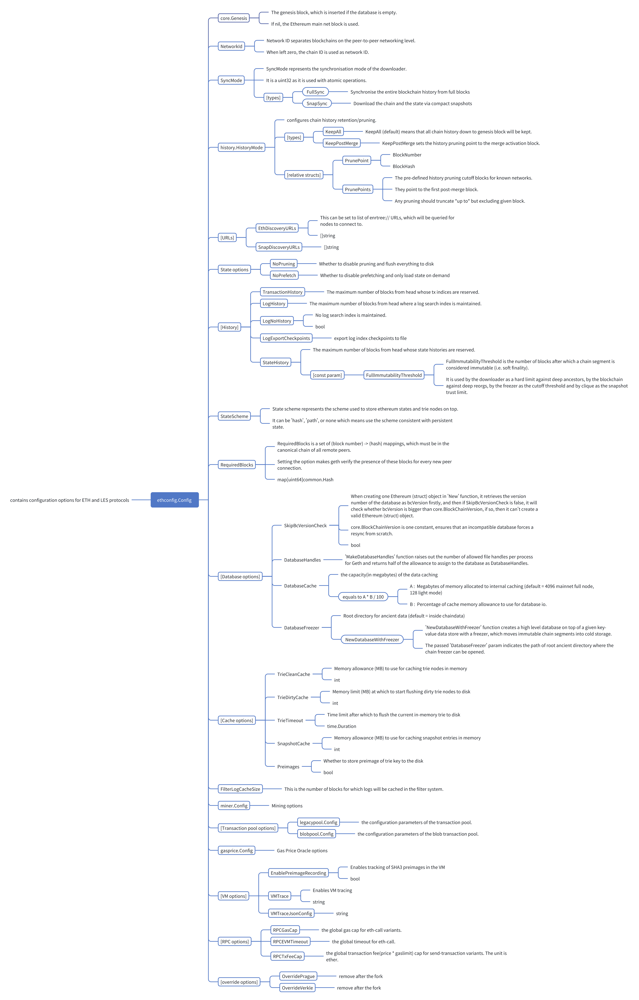

# Ethereum struct

```go
// Ethereum implements the Ethereum full node service.
type Ethereum struct {
        // core protocol objects
        
        // Config contains configuration options for ETH and LES protocols.
        config         *ethconfig.Config
        
        // TxPool is an aggregator for various transaction specific pools, collectively
        // tracking all the transactions deemed interesting by the node. Transactions
        // enter the pool when they are received from the network or submitted locally.
        // They exit the pool when they are included in the blockchain or evicted due to
        // resource constraints.
        txPool         *txpool.TxPool
        
        // TxTracker is a struct used to track priority transactions; it will check from
        // time to time if the main pool has forgotten about any of the transaction
        // it is tracking, and if so, submit it again.
        // This is used to track 'locals'.
        // This struct does not care about transaction validity, price-bumps or account limits,
        // but optimistically accepts transactions.
        localTxTracker *locals.TxTracker
        
        // BlockChain represents the canonical chain given a database with a genesis
        // block. The Blockchain manages chain imports, reverts, chain reorganisations.
        blockchain     *core.BlockChain

        // The core instance for all Ethereum chain management protocol.
        handler *handler
        
        // FairMix aggregates multiple node iterators, it attempts to draw from all 
        // sources equally often. However, if a certain source is slow and doesn't 
        // return a node within the configured timeout, a node from any other source 
        // will be returned.
        discmix *enode.FairMix
        
        // dropper monitors the state of the peer pool and makes changes as follows:
        //   - during sync the Downloader handles peer connections, so dropper is disabled
        //   - if not syncing and the peer count is close to the limit, it drops peers
        //     randomly every peerDropInterval to make space for new peers
        //   - peers are dropped separately from the inboud pool and from the dialed pool
        dropper *dropper

        // DB interfaces
        // Database contains all the methods required by the high level database to not
        // only access the key-value data store but also the ancient chain store.
        chainDb ethdb.Database // Block chain database

        eventMux       *event.TypeMux
        
        // Engine is an algorithm agnostic consensus engine.
        engine         consensus.Engine
        accountManager *accounts.Manager

        filterMaps      *filtermaps.FilterMaps
        closeFilterMaps chan chan struct{}

        APIBackend *EthAPIBackend

        miner    *miner.Miner
        gasPrice *big.Int

        networkID     uint64
        netRPCService *ethapi.NetAPI

        p2pServer *p2p.Server

        lock sync.RWMutex // Protects the variadic fields (e.g. gas price and etherbase)

        shutdownTracker *shutdowncheck.ShutdownTracker // Tracks if and when the node has shutdown ungracefully
}
```
## ethconfig.Config struct


go-ethereum use the following directive to automatically generate boilerplate code for the Config struct to handle TOML serialization and deserialization. It simplifies the process of maintaining consistent encoding/decoding logic for the Config struct.
```go
//go:generate go run github.com/fjl/gencodec -type Config -formats toml -out gen_config.go
```

## params.ChainConfig

### Replay Protection
Replay protection ensures that a transaction signed and broadcast on one Ethereum network (e.g., mainnet) cannot be replayed on another network (e.g., a testnet like Sepolia or Holesky). Without replay protection, a malicious actor could take a valid transaction from one network and broadcast it on another, potentially causing unintended consequences.

The ChainID in the ChainConfig is used for replay protection to prevent transactions from being replayed on different Ethereum networks. Here's why:<br>
| reason | description |
|--------|-------------|
| 1. Unique Identifier for Each Network | a. The ChainID is a unique identifier for each Ethereum network.<br> b. This ensures that transactions are tied to a specific network.  | 
| 2. Inclusion in Transaction Signing | a. When a transaction is signed, the ChainID is included as part of the transaction's signature data.<br> b. The signature is calculated using the ChainID, ensuring that the transaction is valid only for the network with the matching ChainID. | 
| 3. Validation During Transaction Processing | a. When a transaction is received by a node, the node checks the ChainID in the transaction against its own network's ChainID.<br> b. If the ChainID does not match, the transaction is rejected as invalid. | 
| 4. Prevention of Cross-Network Replays | a. Since the ChainID is part of the signature, a transaction signed for one network cannot be replayed on another network with a different ChainID.<br> b. Even if the transaction data (e.g., sender, recipient, amount) is identical, the signature will not be valid on a network with a different ChainID. |

### TerminalTotalDifficulty
The TerminalTotalDifficulty configuration in Ethereum specifies the total cumulative difficulty that the network must reach to trigger a consensus upgrade. This parameter was introduced as part of The Merge, which transitioned Ethereum from Proof-of-Work (PoW) to Proof-of-Stake (PoS).

| Key Points | Description |
|------------|-------------|
| 1. Definition | a. TerminalTotalDifficulty is a threshold value representing the total difficulty of all blocks mined in the Ethereum blockchain.<br> b. It is expressed as a big.Int because the cumulative difficulty can be a very large number. | 
| 2. Purpose | a. It determines the point at which the Ethereum network stops using Proof-of-Work (PoW) and switches to Proof-of-Stake (PoS).<br> b. This ensures a smooth transition during The Merge without relying on block numbers, which can vary due to network conditions. |
| 3. How It Works | a. During block validation, nodes compare the cumulative difficulty of the blockchain to the TerminalTotalDifficulty value.<br> b. If the cumulative difficulty equals or exceeds the TerminalTotalDifficulty, the network transitions to PoS, and no further PoW blocks are accepted. |
| 4. Why Use Total Difficulty Instead of Block Numbers | a. Block numbers can be manipulated by miners (e.g., by mining empty blocks faster or slower).<br> b. Total difficulty is a more reliable metric because it reflects the actual work done by miners, making it harder to manipulate. | 
| 5. Significance in The Merge | a. The TerminalTotalDifficulty was a critical parameter for Ethereum's transition from PoW to PoS.<br> b. It ensured that the transition occurred at a specific point in the network's history, regardless of block timing or miner behavior. | 

### Manipulate block numbers
Miners can manipulate block numbers in the following ways:
| Manipulation Method | What Happens | Impact | 
|---------------------|--------------|--------|
| 1. Mining Empty Blocks | a. Miners can intentionally mine blocks without including any transactions (empty blocks).<br> b. Empty blocks are faster to mine because they do not require computational effort to validate and process transactions. | a. By mining empty blocks, miners can artificially increase the block number at a faster rate than normal.<br> b. This can disrupt the network's reliance on block numbers for scheduling upgrades or forks. |
| 2. Delaying Block Production | a. Miners can intentionally delay the production of new blocks by withholding their mining power.<br> b. This slows down the rate at which new blocks are added to the blockchain. | By delaying block production, miners can postpone network upgrades or forks that are scheduled based on block numbers. | 
| 3. Coordinated Manipulation | A group of miners (a mining pool) can coordinate to manipulate block numbers by either speeding up or slowing down block production. | This can create inconsistencies in the blockchain and disrupt the timing of network upgrades or forks. | 